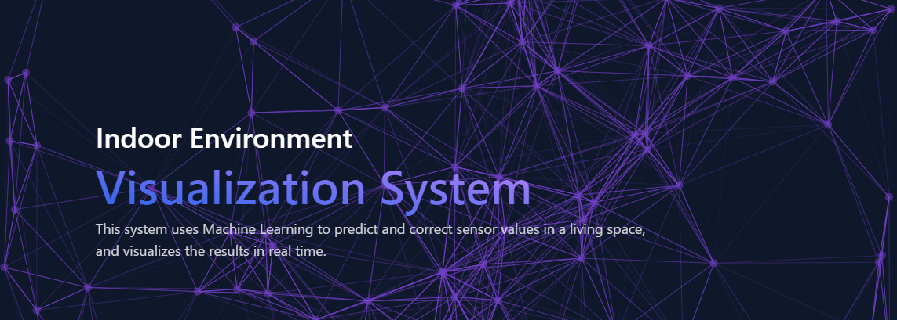
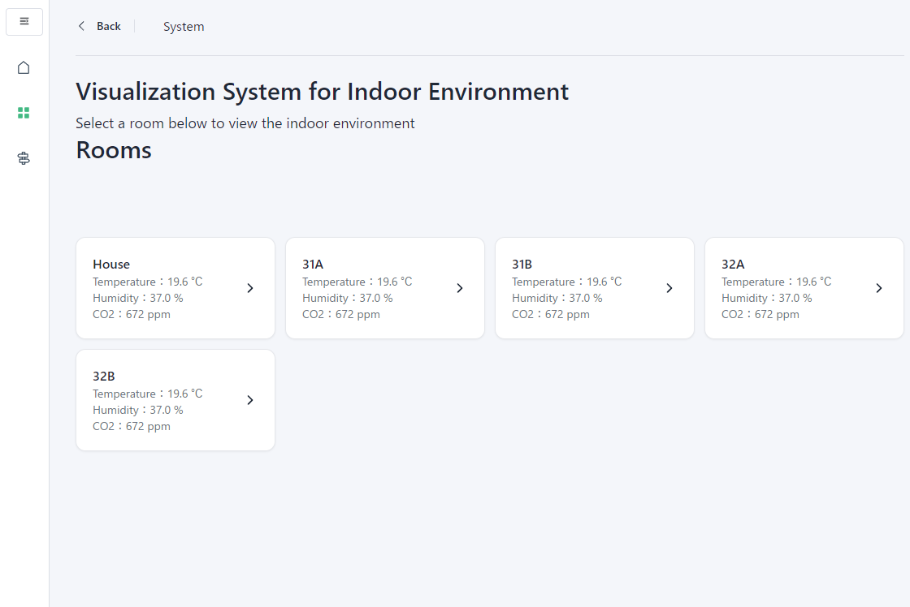
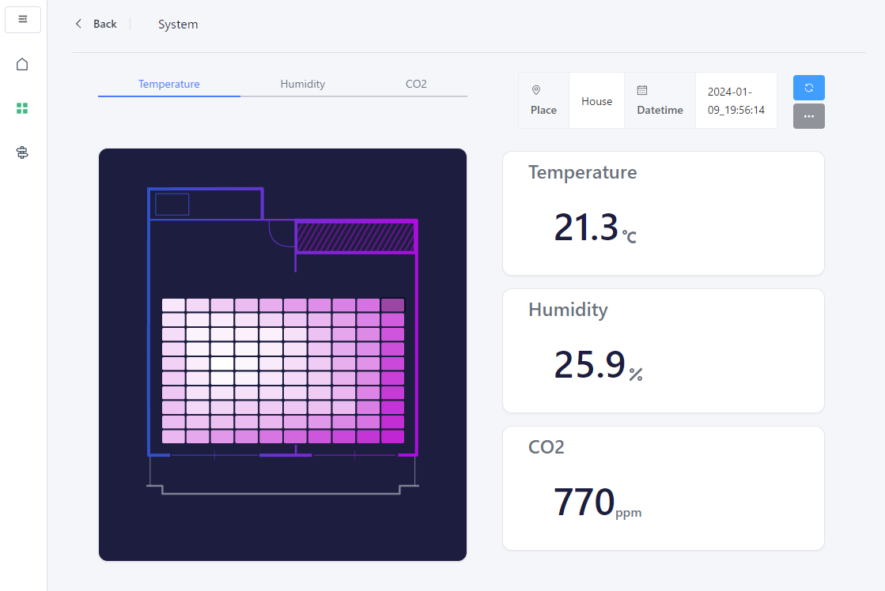
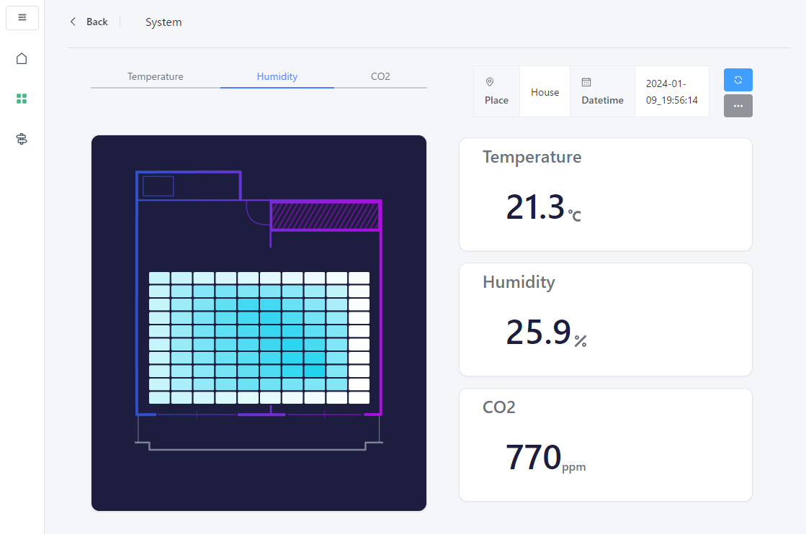
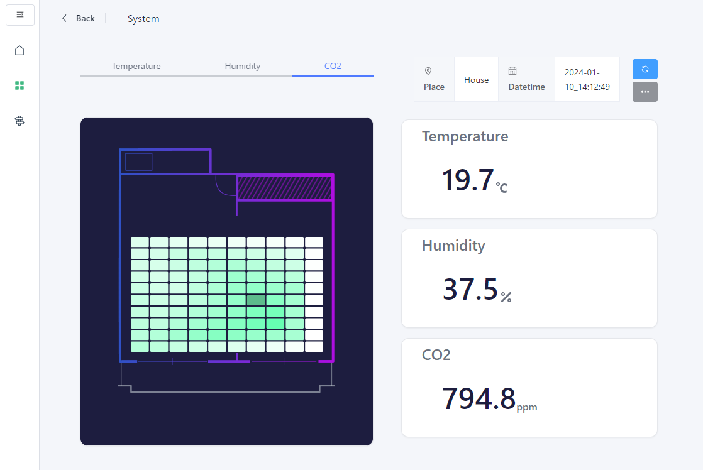
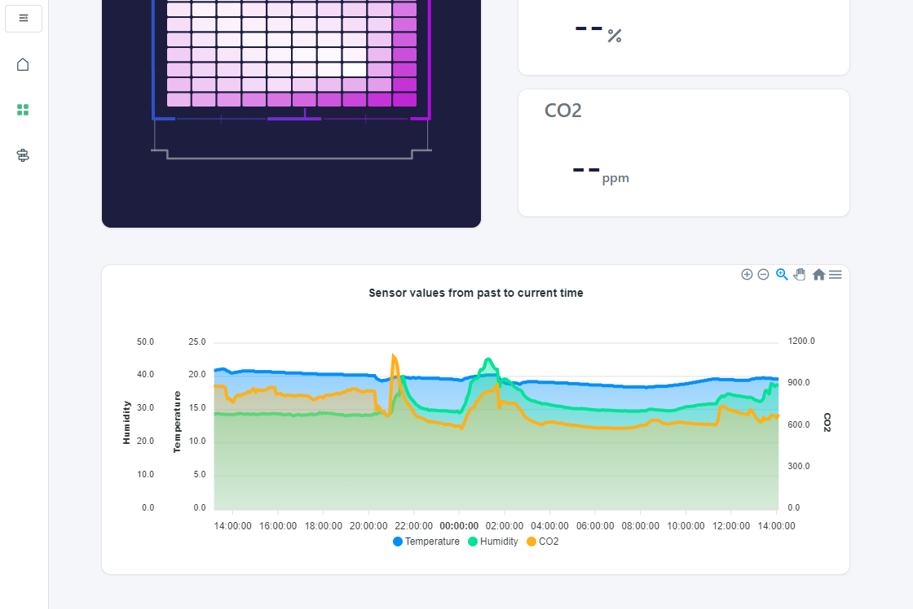
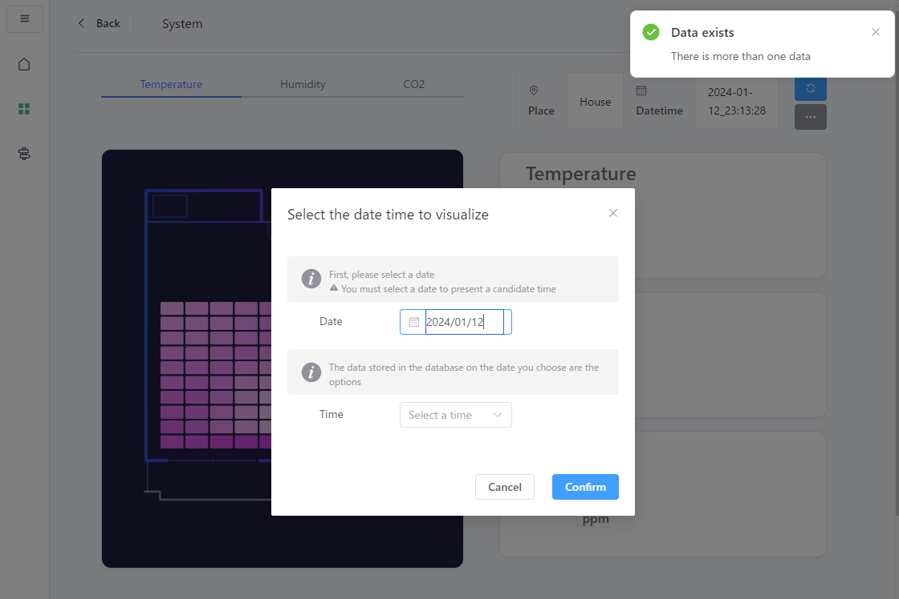
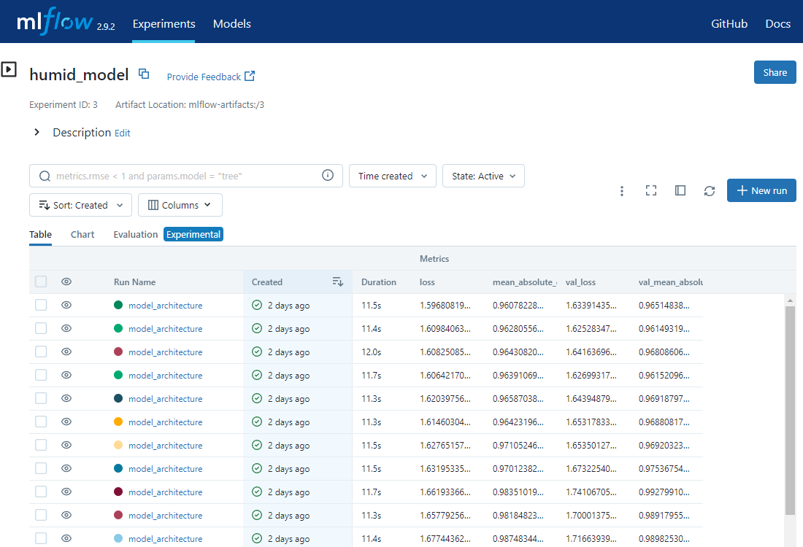
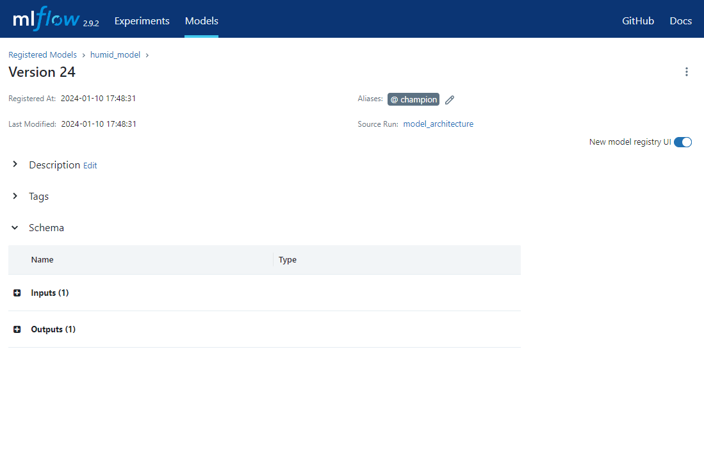
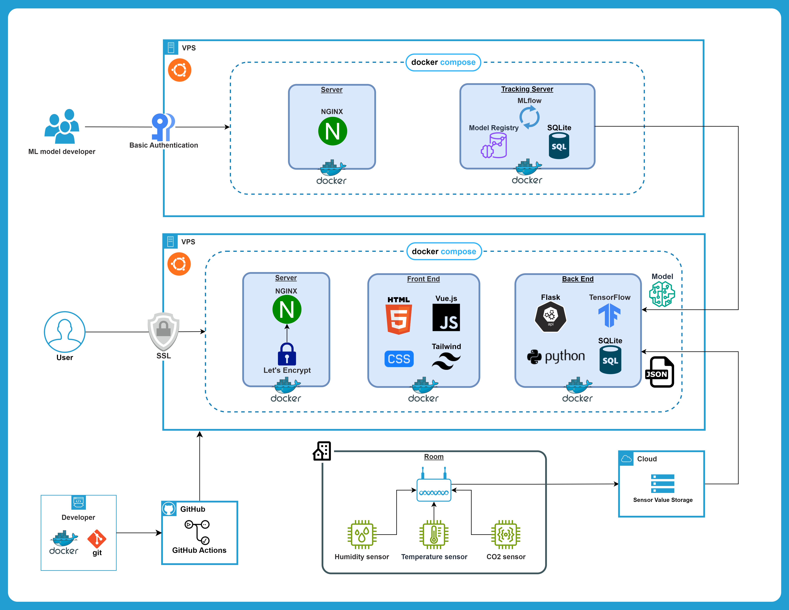

 
## システムURL
https://arakawabase.com/

## システム背景
近年、BEMS(ビル･エネルギー管理システム)をはじめとする、建物管理のための室内熱環境計測センサーが建物に設置され、建築設備の最適運転が図られている。しかし、センサー設置位置は、壁面等の施工段階で取付可能な位置が選択されることが多いため，居住空間※の熱環境とセンサー値に乖離が生じるという課題が挙げられている。したがって、建築設備の最適運転が図るためには、センサー値を居住空間の値に補正する必要がある。
 
本システムはその課題を解決することを目的としており、機械学習により居住空間の値を予測・補正し、その結果をリアルタイムに可視化するシステムである。本システムにおいて可視化の対象とするセンサーは、**温度センサー**、**湿度センサー**、**CO2濃度センサー**の3つである。
 
（※ 居住空間：部屋の中央や中央に近い領域で、生活活動を行うための主要なスペース。）

## システム動作イメージ

## ユーザ側機能一覧
| ホーム画面 |　温度分布可視化画面 |
| ---- | ---- |
|  |  |
| 予測結果を確認したい部屋を選択する画面。それぞれの部屋のセンサー値を一目で確認することもできる。 | AIによって予測された温度分布をリアルタイムで可視化する画面。ヒートマップのセルをクリックするとその場所の温度・湿度・CO2濃度を確認できる。 |

| 湿度分布可視化画面 |　CO2濃度分布可視化画面 |
| ---- | ---- |
|  |  |
| 上部のタブボタンで表示する情報を変更できる。こちらはAIによって予測された湿度分布をリアルタイムで可視化する画面 | AIによって予測されたCO2濃度分布をリアルタイムで可視化する画面。|

| センサー値の推移可視化画面 | 過去の分布の選択画面 |
| ---- | ---- |
|  |  |
| 各分布可視化画面の下部では、その部屋におけるセンサー値の推移を確認できる。 | 過去の予測結果の分布をDBから取得し表示する画面|

## AIモデル開発者側機能一覧
本システムではAIモデルのライフサイクル管理ツールとしてオープンソースフレームワークの**MLflow**を使用している。
| 実験管理画面 | モデル選択画面 |
| ---- | ---- |
|  |  |
| 実験時の環境を一元管理している。 | データの傾向変化に応じて迅速にモデルを更新できるよう、Aliasesに`@champion`を付与するだけで本番環境のモデルを更新できるようにしてある。 |

## 使用技術一覧
### Frontend

    
    
    

### Backend

    
    

### Database

    

### Model development

    
    
    
    
    
    

### Environment setup

    

### etc.

    
    
    
    
    
    
    
    
    

## インフラ構成図

## 今後の課題
現状、データの収集および予測モデルの構築が完了しているのが"House"のみとなっている。したがって、"House"以外の部屋については"House"の予測結果をそのまま表示している。今後は"House"以外の部屋についてもデータの収集および予測モデルの構築を行い、予測結果を表示できるようにする。